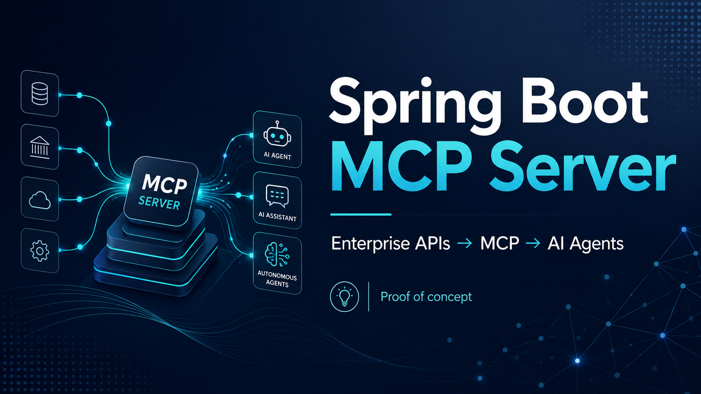

# MCP Demo README

This repository demonstrates how to interact with a local Model Context Protocol (MCP) server to fetch contextual data via structured tools.


## Configuration

- MCP server name: sud-datta-mcp
- JAR: [`mcp-demo-0.0.1-SNAPSHOT.jar`](../convera/code/spring-boot-mcp-server/target/mcp-demo-0.0.1-SNAPSHOT.jar)
- Settings location: [`mcp_settings.json`](../Library/Application Support/Code/User/globalStorage/rooveterinaryinc.roo-cline/settings/mcp_settings.json)

Server settings (as stored in mcp_settings.json)

```json
{
  "mcpServers": {
    "sud-datta-mcp": {
      "command": "java",
      "args": [
        "-jar",
        "/Users/ssd/code/spring-boot-mcp-server/target/mcp-demo-0.0.1-SNAPSHOT.jar"
      ]
    }
  }
}
```

## Usage

- Start the MCP server by launching the JAR above.
- Retrieve teacher lists using the following MCP tools:
    - ListOfAllowedTeachers
    - ListOfDisAllowedTeachers

## Example results (based on current run)

- Allowed teachers: Kelvin, Mavin, Zilvinas, Gytis
- Disallowed teachers: Doontu, Diego, Maya, Sarah

## How to run

- Ensure the jar exists at the path above and start it with:
    - java -jar [path to jar]

## Notes

- The current data reflects a live MCP session and may vary over time.
- The environment shows the following files of interest:
    - mcp_settings.json: [`mcp_settings.json`](../Library/Application Support/Code/User/globalStorage/rooveterinaryinc.roo-cline/settings/mcp_settings.json)
    - MCP server jar: [`mcp-demo-0.0.1-SNAPSHOT.jar`](../code/spring-boot-mcp-server/target/mcp-demo-0.0.1-SNAPSHOT.jar)

## References

- mcp_settings.json location: [`mcp_settings.json`](../Library/Application Support/Code/User/globalStorage/rooveterinaryinc.roo-cline/settings/mcp_settings.json)
- MCP server jar: [`mcp-demo-0.0.1-SNAPSHOT.jar`](../code/spring-boot-mcp-server/target/mcp-demo-0.0.1-SNAPSHOT.jar)
